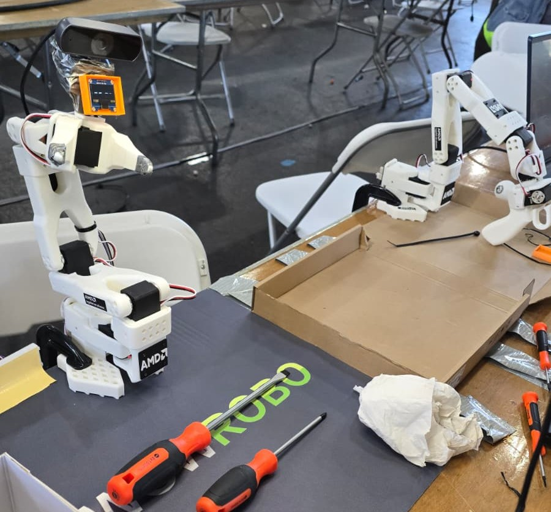

# Sparky — AI Desk Companion

> 🏆 **2nd Prize — AMD Track, StarkHacks Hackathon**



A voice-controlled robotic desk companion for children, built on a **WowRobo SO-101** arm. Sparky tracks faces, tutors kids by looking at their homework through a camera, and responds to voice commands. Built for the **StarkHacks hackathon**, the worlds largest hardware hackathon.

---

## Hardware Setup

| Device | Port | Power |
|---|---|---|
| SO-101 Follower arm | `/dev/ttyACM1` | 12V 8A |
| SO-101 Leader arm | `/dev/ttyACM2` | 5V 6A |
| Arduino Nano (OLED eyes) | `/dev/ttyUSB0` (auto-detected) | USB |
| Side camera (face tracking) | `/dev/video2` | USB |
| Top camera (Gemini vision) | `/dev/video4` | USB |

---

## Environment Setup

```bash
conda activate lerobot
export HSA_OVERRIDE_GFX_VERSION=11.0.0   # AMD iGPU — already in ~/.bashrc
sudo chmod 666 /dev/ttyACM1 /dev/ttyACM2  # run after every reboot
```

Add your Gemini API key to `~/.bashrc`:
```bash
export GEMINI_API_KEY="your-key-here"
```

### Python Dependencies

```bash
pip install google-generativeai opencv-python numpy sounddevice scipy pyserial kokoro-onnx
```

---

## Running Sparky

**Full system (arm + voice + vision + OLED):**
```bash
python companion.py
```

**Voice + vision only (no arm):**
```bash
python main.py
```

**Face tracking + OLED eyes only:**
```bash
python /home/aup/lerobot/face_track_eyes.py
```

**Move arm to a saved pose:**
```bash
python goto_pose.py home          # move and hold
python goto_pose.py home --once   # move and release torque
python goto_pose.py list          # show all saved poses
```

**Diagnostics:**
```bash
python test_audio.py              # test speaker output
python /home/aup/lerobot/preview_cameras.py   # preview both cameras
```

---

## How It Works

### State Machine (`companion.py`)

Sparky runs a three-state loop:

```
sleeping  →  tracking  →  desk_view
```

| State | Trigger | Behavior |
|---|---|---|
| `sleeping` | startup | Waits for "wake up". OLED shows BORED. |
| `tracking` | "wake up" | Launches face tracker subprocess. Arm follows faces. |
| `desk_view` | "help me" / "look at this" | Arm moves to home pose, top camera captures homework, Gemini analyzes. |

**Serial port handoff**: before launching `face_track_eyes.py`, `companion.py` releases the Arduino serial port; it reclaims it after killing the subprocess.

---

### Voice Recognition (`voice.py`)

- Mic: `amd-soundwire hw:3,4` (device 8)
- Records at 48000 Hz, resampled to 16000 Hz for Whisper
- Returns an intent dict with keys: `mode`, `target`, `transcript`

**Intent types:**
| Intent | Action |
|---|---|
| `knowledge` | Answer via Gemini text (no arm movement) |
| `tutor` / `identify` | Arm moves to home, camera snapshot, Gemini tutor response |
| `wake` | Transition to tracking state |
| `idle` / `clean` | State transitions |

**Hardcoded responses** (bypass Gemini):
- "what is your name" / "who are you" → Sparky intro
- "powered by" / "your cpu" → AMD Ryzen AI response

---

### Vision AI (`gemini_vision.py`)

Uses **Google Gemini** (via API) with a rolling conversation history (last 3 exchanges).

| Method | Description |
|---|---|
| `tutor(question, image)` | Captures snapshot + answers homework question |
| `reply(answer)` | Conversational follow-up, no new snapshot |
| `ask_text(question)` | Pure text Q&A, no image, no history |
| `identify()` | Scans desk and describes what it sees |

---

### Face Tracking (`face_track_eyes.py`)

PID controller drives the arm's shoulder pan joint (±60°) to keep a detected face centered.

- Camera frame is rotated 90° clockwise before detection
- Fixed joints: `SHOULDER_LIFT = -55°`, `ELBOW_FLEX = 40°`, `WRIST_ROLL = -50°`
- High-confidence lock: when face score > 0.5, arm freezes for 3 seconds

OLED state flow:
```
SCANNING → FOUND (1s) → TRACKING → LOST → SCANNING
```

---

### Text-to-Speech (`sparky.py`)

Backend chain (in order of priority):
1. **Kokoro-ONNX** (primary) — local neural TTS, 54 voices
2. **espeak-ng** (fallback)

Speaker: `amd-soundwire hw:3,2` (device 7). All audio is upmixed mono→stereo (device requires 2 channels).

Model files (not tracked in git — download separately):
- `kokoro.onnx`
- `voices/voices-v1.0.bin`

---

### Arm Control (`goto_pose.py`)

Pose presets are stored in `pose_presets.json`. Movement is smoothly interpolated over ~60 steps (~1.2s).

```bash
python goto_pose.py list          # show all poses
python goto_pose.py home          # move to home and hold torque
python goto_pose.py home --once   # move then release torque
```

---

### OLED Eyes (Arduino Nano)

Commands sent as plain strings over serial at 115200 baud. Arduino ACKs with `ACK:<command>`.

| Command | Expression |
|---|---|
| `SCANNING` | Pupils slide left/right |
| `FOUND` | Eyes grow wide |
| `TRACKING` | Happy squint + smile |
| `LOST` | Darting eyes + floating `?` |
| `BORED` | Droopy eyelids + wavy mouth |
| `NEUTRAL` | Gentle blink |

Sketch: `arduino/eyes_sketch/eyes_sketch.ino`

---

## Known Quirks

- **Camera warmup**: After releasing `/dev/video2`, 20 frames are flushed before reading to avoid black/stale frames.
- **kokoro-onnx v0.5.0 bug**: `speed` input type was `int32` instead of `float32` — patched directly in the installed package.
- **voices file**: `voices-v1.0.bin` requires `allow_pickle=True` — also patched in the installed package.
- **Desk timeout**: 12 seconds before returning to tracking mode.

---

## File Overview

| File | Purpose |
|---|---|
| `companion.py` | Main entry point, state machine, serial lifecycle |
| `voice.py` | Whisper STT + intent classification |
| `gemini_vision.py` | Gemini vision/text AI |
| `sparky.py` | Kokoro TTS + espeak fallback |
| `goto_pose.py` | Arm pose control with interpolation |
| `pose_presets.json` | Saved arm poses |
| `config.py` | Shared config constants |
| `main.py` | Lightweight voice+vision entry point (no arm) |
| `arduino/eyes_sketch/` | Arduino OLED eye animation firmware |

---

## License

See [LICENSE](LICENSE).
